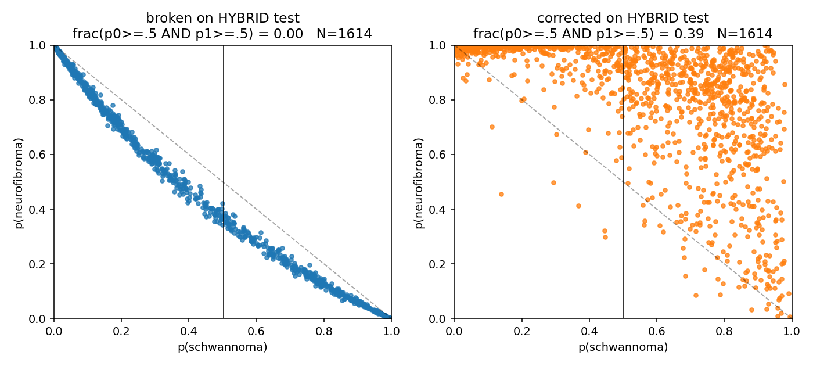
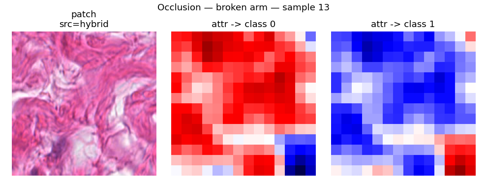
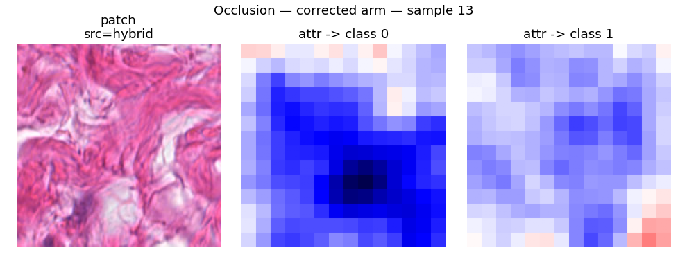

# xai-model-autopsy

*When 0.96 F1 means nothing: an XAI autopsy of a histopathology classifier.*

> Metrics said this histopathology classifier worked; explainability
> methods proved it couldn't — this repository documents the diagnosis,
> the fix, and the verified difference.

## 60 seconds

I trained a ConvNeXt-Small patch classifier for schwannoma vs
neurofibroma on a private clinical archive of `.ndpi` whole-slide
images (~3.1M training patches at 224×224). Validation macro-F1 was
~0.96. On held-out hybrid slides — where both tumour types coexist —
the model was structurally incapable of saying "both". A two-line
change in the labelling let it say "both" on 38.7% of hybrid patches,
up from zero. This repo reproduces the defect, then reproduces the fix
under a controlled comparison on the same frozen backbone.

Headline numbers, real data, 8 697 pure-class + 1 614 hybrid test
patches, same seed both arms:

| metric | broken arm | corrected arm |
|---|---:|---:|
| Pearson r(p0, p1) on pure test | **−0.996** | −0.784 |
| mean \|p0 + p1 − 1\| on pure test | **0.025** | 0.168 |
| hybrid patches predicted as both classes (p0≥0.5 AND p1≥0.5) | **0 / 1 614** | **624 / 1 614 (38.7%)** |



The broken arm's two sigmoid outputs sum to ~1 by construction — it
cannot fire both neurons at once. The corrected arm can.

Run the synthetic demo (no data required, ~10 seconds, works anywhere):

```bash
uv venv && source .venv/bin/activate && uv pip install -e . && python -m defect_demo.run
```

## What this repo is about

I trained a ConvNeXt-Small patch classifier on schwannoma and
neurofibroma whole-slide images (`.ndpi`) for my bachelor's thesis.
Thesis corpus: 371 WSIs (~27 GB) — 144 neurofibroma / 189 schwannoma
/ 38 hybrid, from 30 / 28 / 15 individuals (numbers per the thesis;
this machine holds a subset). Training patches: ~3.13M at 224×224
(per `Pipeline/PORTFOLIO_RECON_REPORT.md` §E), weak slide-level labels
from pathology reports, Ray Tune HPO. The validation macro-F1
reported in the thesis was ~0.9582. On held-out hybrid slides — where
both tumour types are present in the same tissue — the model
collapsed: it could never output "both classes present" because the
two sigmoid outputs behaved as if they were softmaxed.

Six post-hoc XAI methods (Captum Occlusion, Integrated Gradients,
Input×Gradient, DeepLIFT, KernelSHAP on embeddings, saliency) all
pointed at the same defect: a two-neuron BCE head trained on mutually
exclusive one-hot labels had learned p0 ≈ 1 − p1 as a hard invariant.
Metrics never caught it because pure-class test data satisfies the
same invariant. This repository is the autopsy: the diagnosis with
XAI, then a controlled broken-vs-corrected reproduction on a modest
real subsample.

## The defect

Three lines, in the thesis trainer:

1. **Two-neuron head.** `Pipeline/temp_ZZZZZZ_trainer_final.py:96`
   ```python
   nn.Linear(hidden_dim, num_classes)   # num_classes = 2
   ```
2. **Mutually exclusive one-hot label.**
   `Pipeline/temp_ZZZZZZ_trainer_final.py:387` (and identically :407)
   ```python
   Lambdad(keys="label", func=lambda x: np.array(
       [float(x == 0), float(x == 1)], dtype=np.float32
   ))
   ```
3. **BCEWithLogitsLoss.**
   `Pipeline/temp_ZZZZZZ_trainer_final.py:152`
   ```python
   self.criterion = torch.nn.BCEWithLogitsLoss()
   ```

BCEWithLogitsLoss treats each output neuron as an independent
Bernoulli — that is the intent recorded in the pre-defect code
comment, `Pipeline/models/classifier.py:24`:

```python
#nn.Sigmoid()  # Sigmoid activation for independent probabilities - using BCEWithLogitsLoss to apply sigmoid later and allow for more freedome with the model
```

But the label encoder above only ever emits `[1, 0]` or `[0, 1]`; the
`[1, 1]` and `[0, 0]` corners of the label space are never seen.
Under BCE, the gradient signal that would push both neurons up
simultaneously (or both down) never arrives. The network learns the
single simplest invariant compatible with the training data: `p0 + p1
≈ 1`. Two independent sigmoids collapse into an implicit softmax. The
architecture allows "both" or "neither"; the label geometry forbids
either from ever being observed.

## The diagnosis (how XAI localised the fault)

The thesis's six XAI methods each contributed a distinct symptom.

- **Occlusion (Captum).** Attribution maps for target class 0 and
  target class 1 on the same patch are near-perfect mirrors of each
  other — hiding evidence for schwannoma automatically raises evidence
  for neurofibroma, structurally. Gradients through opposing sigmoids
  of a shared representation with a forced sum-to-1 output are exact
  negatives of each other; occlusion inherits that. Numeric mirror
  metric on 18 held-out patches (per-sample Pearson r between the two
  attribution maps, flattened): **broken arm mean −0.997** (every
  sample < −0.99); **corrected arm mean −0.589** (one sample flipped
  to +0.061). Full per-arm distribution in `docs/PHASE_1_RESULT.md`
  §5d-quant.

  Broken arm — sample 13 (hybrid patch), the two class-target
  attribution maps are exact colour-inverses:

  

  Corrected arm — same sample, same seed, same occlusion parameters:

  
- **Integrated Gradients / Input×Gradient / DeepLIFT.** In the thesis
  figures, the three methods produced near-identical attribution maps
  *across each other* despite different mechanisms — evidence of a
  shallow, low-diversity fit on a frozen representation rather than
  three independent explanations converging on the same signal.
- **KernelSHAP on the 768-dim embedding.** Attribution mass
  concentrates on ~5 of 768 backbone features. The head is fitting a
  very small subspace of the frozen representation.
- **Saliency.** Highlights intercellular space rather than nuclei —
  a symptom that a broken decision boundary is being explained, not a
  meaningful clinical one.

Individually any of these could have been dismissed as an XAI
artefact. Together they name the same failure: the model is using a
degenerate, mutually-exclusive parameterisation of the label space,
and post-hoc explanations can only reflect that.

## Reproduction (this repo)

Two experiments, in order of surface area.

**1) Synthetic reproduction** (`defect_demo/run.py`). Same head
architecture and loss the thesis used, on 4-cluster 2-D Gaussians.
Two arms trained identically except for the label space (broken =
pure-only, corrected = pure + hybrid `[1,1]` + background `[0,0]`).
Runs in seconds on any laptop, no data required. Confirms the defect
in the simplest possible setting.

**2) Real-data reproduction** (`pipeline/`). Extracts 76 888 tissue
patches from 58 whole-slide images spanning 55 patients across three
classes (5 hybrid + 22 neurofibroma + 28 schwannoma); embeds every
patch through
a frozen ConvNeXt-Small; trains two MLP heads (broken = pure-only /
`[1,0]`/`[0,1]`, corrected = pure + hybrid `[1,1]`) with everything
else — architecture, optimizer, hyperparameters (from the thesis's
Ray Tune best config), sampler, seed — identical between arms.
Person-level train/val/test splits are enforced by a running
assertion (`pipeline.manifest.validate` raises on any patient overlap;
`tests/test_manifest_and_split.py` exercises it). See
`docs/PHASE_1_RESULT.md` for the full manifest and design log.

**Results on the real subsample** (from `PHASE_1_RESULT.md` §5,
`workdir/diagnostics.json`):

Coupling on 8 697 pure-class test patches:

| arm | Pearson r(p0, p1) | mean \|p0+p1−1\| |
|---|---:|---:|
| broken    | **−0.9959** | **0.0246** |
| corrected | −0.7844 | 0.1679 |

Behaviour on 1 614 held-out hybrid test patches:

| arm | p0 mean | p1 mean | (p0+p1) mean | frac(p0≥.5 AND p1≥.5) |
|---|---:|---:|---:|---:|
| broken    | 0.250 | 0.705 | 0.955 | **0.000** |
| corrected | 0.430 | 0.849 | 1.279 | **0.387** |

Metrics on the pure-class test set (multilabel-macro F1, the thesis's
metric of choice):

| arm | precision | recall | F1 |
|---|---:|---:|---:|
| broken    | 0.729 | 0.866 | **0.737** |
| corrected | 0.668 | 0.884 | 0.688 |

Argmax per-class F1 is identical to 4 decimal places across arms
(schwannoma ~0.62, neurofibroma ~0.86); the ~0.62/0.86 asymmetry is
driven by the schwannoma-poor test split (2 patients vs 6), not by
the coupling defect. The coupling defect is **invisible** to this
metric.

## What the fix does — and does not — do

The corrected arm adds hybrid-slide patches to training with the
`[1,1]` target. That is a two-line change. It does not fix the
coupling completely: r(p0, p1) drops from −0.996 to −0.784, not to
zero. The reason is mechanical: even in the corrected arm, most
training gradients still come from pure `[1,0]` / `[0,1]` samples,
which still pull the two neurons toward mutual exclusivity. The
`[1,1]` samples are a minority (~6% of training patches — 3,208 of
50,784). The fix is partial by construction. No knob was turned
after seeing these numbers.

An inherent confound: adding `[1,1]` labels necessarily means adding
hybrid tissue that the broken arm never sees. You cannot cleanly
attribute the improvement to "label geometry" versus "richer training
distribution" — the two are entangled by design, because you cannot
put a `[1,1]` label on a pure-class patch honestly.
See `docs/design_notes.md` §2 for the full argument.

## Post-thesis code audit

Two verification findings on my own thesis code, added after the fact:

1. **The clean training script pushed to the university GitLab cannot
   train.** `Network Architecture/antonburckhardtba/anton-ba-network/3_model_training.py:82-85`
   contains `if self.current_epoch == 0: self.trainer.validate(self); exit()`
   inside `training_step`. The checkpoint referenced in the thesis
   (`fulltrain-best-epoch=13-val_f1=0.9582.ckpt`) must have been
   produced by a near-duplicate script
   (`Pipeline/temp_ZZZZZZ_trainer_final.py`) that does not have this
   stub.
2. **The backbone freeze described in the thesis was not enforced in
   the checkpoint-producing trainer.** In
   `Pipeline/temp_ZZZZZZ_trainer_final.py`, the ConvNeXt-Small feature
   extractor only calls `.eval()` (line 89) — never
   `.requires_grad_(False)` — and the optimizer receives
   `self.parameters()` (line 236), so backbone weights were updated
   end-to-end despite the thesis text describing a frozen backbone.
   This repo asserts a genuine freeze in
   `tests/test_freeze.py::test_backbone_frozen`.

## Limitations

- **This is XAI on a broken model.** The whole exercise compares six
  XAI methods on their ability to surface a coupling defect. It does
  not evaluate them on clinical localisation. A well-behaved model is
  a separate question.
- **The multilabel-F1 gap versus the thesis (0.737 here vs the
  reported 0.9582) has multiple candidate causes and I do not
  attribute it to any single one.** Possible contributors, in no
  particular order:
    - **Possible patient leakage in the thesis splits** `[read-inferred]`.
      The split artifacts in the archive (`Data Temp/`) show every
      schwannoma patient appearing in all three of train/val/test.
      Whether the training run that produced the reported 0.9582
      actually loaded those artifacts was not traced end-to-end;
      this run enforces person-level splits by construction.
    - **Unfrozen backbone in the thesis trainer** (see audit above);
      this run keeps the backbone genuinely frozen.
    - **~40× less training data here** (76 888 patches vs ~3.1M).
    - **Macenko stain normalisation skipped here** (`docs/design_notes.md`
      §6); applied in the thesis.
    - **Hyperparameters** borrowed from the thesis's Ray Tune result
      and applied to a different data regime; they overfit fast here
      (best val loss at epoch 0-2 for both arms).
- **Hybrid test set is small.** 1 614 patches from 2 patients. The
  0.000 → 0.387 double-positive gap is directional; I am not making
  point-estimate claims off two patients.
- **The `[1,1]` hybrid label is a slide-level weak label**
  (`docs/design_notes.md` §3). A hybrid slide contains regions of
  pure schwannoma, pure neurofibroma, and interfacial hybrid tissue;
  not every patch from such a slide is genuinely hybrid at the patch
  scale.
- **Fast overfit under honest splits.** With person-level splits and
  the borrowed hyperparameters, both arms hit best val loss inside
  the first two epochs and then diverge. This does not affect the
  coupling verdict but is a data point worth having.
- **Argmax per-class F1 is dominated by test-split imbalance**, not
  by the coupling. Both arms show the same 0.62 / 0.86 asymmetry to
  four decimal places. This is the metric a naive reader would check
  first, and it is exactly the one where the coupling defect is
  invisible.

## Repo map

```
defect_demo/          synthetic 2-D reproduction, runs anywhere
pipeline/             real-data pipeline (extract, embed, split, train, diagnose, mirror_metric)
tests/                the assertions that hold the design together
figures/
  synthetic/          demo outputs (p0+p1, r(p0,p1), attributions)
  real/               real-data outputs (probability scatters, hybrid)
  occlusion/          3 curated Captum Occlusion mirror pairs (samples 02, 11, 13 × broken/corrected)
docs/
  PHASE_1_RESULT.md   real-data run log — manifest, metrics, deviations
  PHASE_2_RESULT.md   this phase — mirror metric + repo assembly
  design_notes.md     load-bearing choices, kept out of the code
  THESIS_SUMMARY.md   the thesis, in a page
```

## How to reproduce

Environment (macOS 13, Python 3.11):

```bash
uv venv
source .venv/bin/activate
uv pip install -e ".[dev]"
pytest -q                      # 16 tests, all passing
python -m defect_demo.run      # synthetic demo, ~10 s
```

The synthetic demo is the only stage a stranger can run without the
clinical dataset. Real-data stages (`pipeline.extract`,
`pipeline.embed`, `pipeline.train`, `pipeline.diagnose`,
`pipeline.mirror_metric`) require the archive of `.ndpi` slides.
The archive path is read from `XAI_AUTOPSY_ARCHIVE` (env var) and
defaults to the author's local archive location (see
`pipeline/extract.py`).
The `.gitignore` prevents any patches, embeddings, or checkpoints
from ever entering the repo; all such artifacts live in the
sibling workdir `~/projects/xai-model-autopsy-workdir/`.

Seeds: `SEED = 20260820`, applied to numpy, torch, and every random
sampler. `torch==2.4.x` is pinned because 2.5+ requires macOS 14 for
MPS (`docs/design_notes.md` §7).

Real-data reproduction, if you have the archive:

```bash
python -m pipeline.extract           # ~1h 47m on M2
python -m pipeline.embed             # ~10h 46m on M2 (num_workers=0 is the bottleneck)
python -m pipeline.train             # ~90 s on cached embeddings
python -m pipeline.diagnose          # ~10 min (includes Occlusion)
python -m pipeline.mirror_metric     # ~5 min
```

## License

MIT — see `LICENSE`.

## Author

Anton Burckhardt. The full thesis PDF is available on request.
